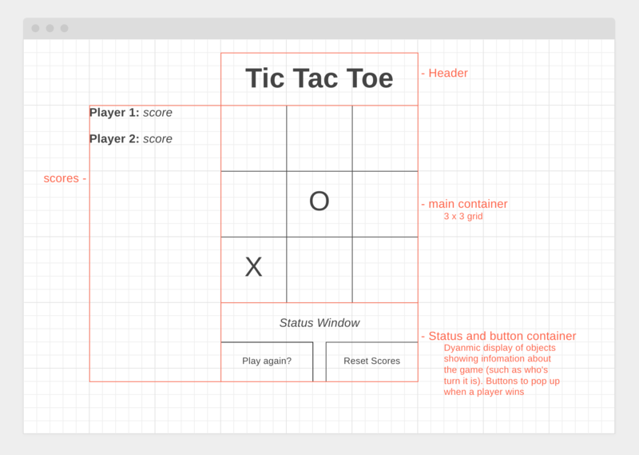

# Tic Tac Toe

GA-SEI - Project 1 - [Live Version](https://tictactoe.mattgrah.am/)

## Technical Requirements

-   Render a game in the browser
-   Switch turns between more than one player
-   Design logic for winning & visually display which player won
-   Include separate HTML / CSS / JavaScript files
-   Stick with KISS (Keep It Simple Stupid) principles
-   Use Javascript for DOM manipulation
-   Deploy your game online, where the rest of the world can access it
-   Use semantic markup for HTML and CSS (adhere to best practices)

## Checkpoints

-   [x] Completed designs
-   [x] Set up Git Repo
-   [x] Push basic page
-   [x] Setup Github Pages
-   [x] HTML Layout completed
-   [x] First JavaScript functionality added
-   [x] Suggested that by now you can click on boxes and have them fill in an X or an O
-   [x] Have mostly a functioning game with at least one winning condition done
-   [x] Game complete, bugs fixed
-   [x] CSS polished
-   [x] Readme updated
-   [x] Tested on Github pages
-   [x] Keep track of multiple game rounds with a win counter
-   [x] Get inventive with your styling - research CSS effects, animations to spiff things up
-   Research LocalStorage or SessionStorage to persist data locally to allow games to continue after page refresh or loss of internet connectivity
-   [x] Research web audio API and add sound effects to your game

## Technology Used

-   HTML
-   CSS
-   Javascript

## Planning

### HTML Wireframe

### CSS styles

-   **Font Family:** Lato (https://fonts.google.com/specimen/Lato)

-   **Colours:**
    -   Primary 1: hsl(265, 42%, 63%)
    -   Primary 2: hsl(189, 60%, 34%)
    -   Shade 1: hsl(265, 42%, 85%)
    -   Shade 2: hsl(189, 60%, 85%)
    -   Black: hsl(0, 0%, 0%)
    -   White: hsl(0, 0%, 100%)

### Javascript Challenges

1. Creating a 'X' or 'O' on click

    - Create an addEventListener to watch for a click on each cell
    - when a cell is clicked, check to see who's turn it is and check if the cell is empty
    - if P1 add 'X' to the cell, if P2 add 'O'

2. Identifying who's turn it is

    - create a variable and set it to P1 as P1 starts
    - after each turn change variable to P1 / P2 depending on whose turn it is.
    - Update status bar accordingly

3. Stoping a player from clicking on an tile that already has an 'X' or 'O'

    - when player clicks on a cell it should check if it is empty, if it isn't it should ignore the click

4. Determining a win

    - need to set up an if / else statement showing all possible winning combinations
    - winning combinations are:
        - 1 / 2 / 3
        - 4 / 5 / 6
        - 7 / 8 / 9
        - 1 / 4 / 7
        - 2 / 5 / 8
        - 3 / 6 / 9
        - 1 / 5 / 9
        - 3 / 5 / 7

5. Keeping track of the score

    - Create variables for each player and assign them to 0
    - when a player wins add 1 point to the players score
    - when the reset button is pressed it sets the players score back to 0.

6. setting up play again and reset buttons

    - when a player wins the buttons are shown. Pressing the play again button, resets the board by clearing all cells, and pressing reset scores, clears the board and also sets the scores to 0.
